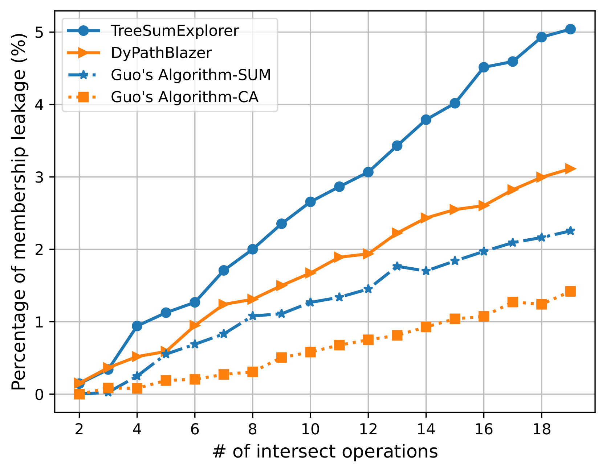
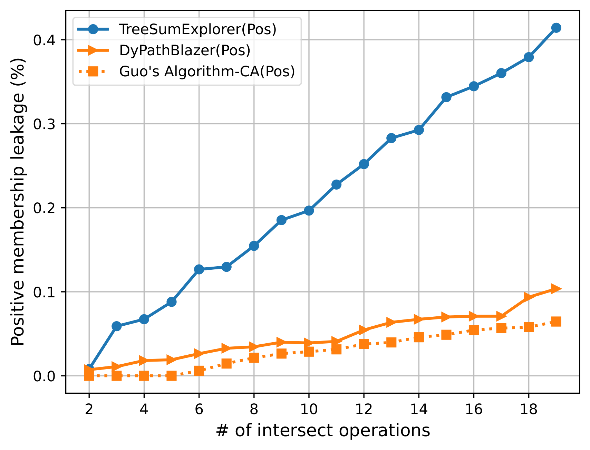
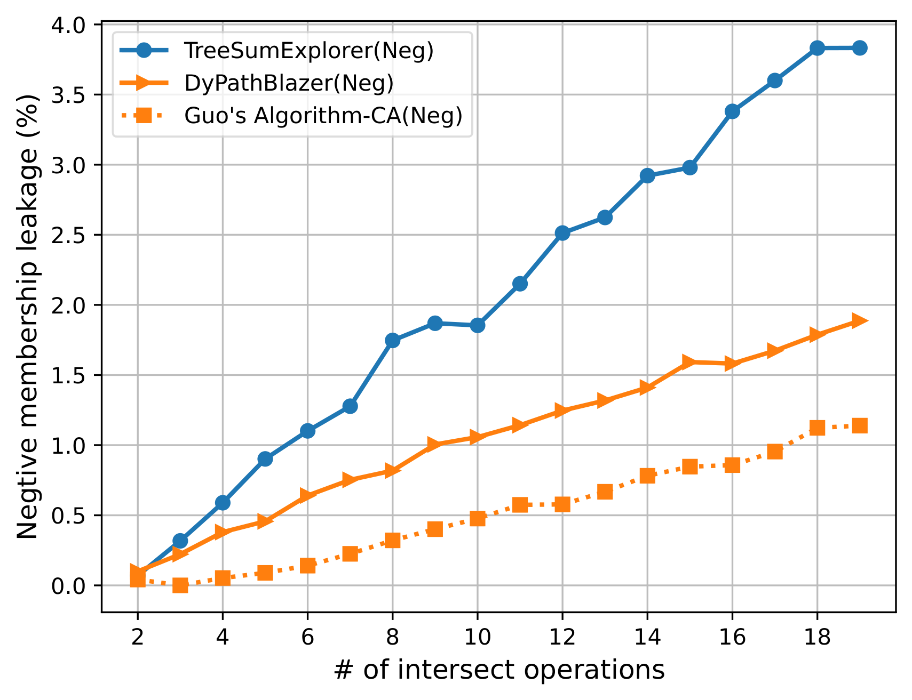
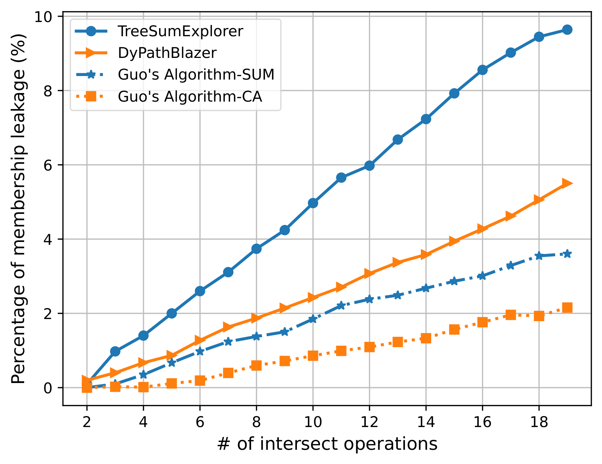
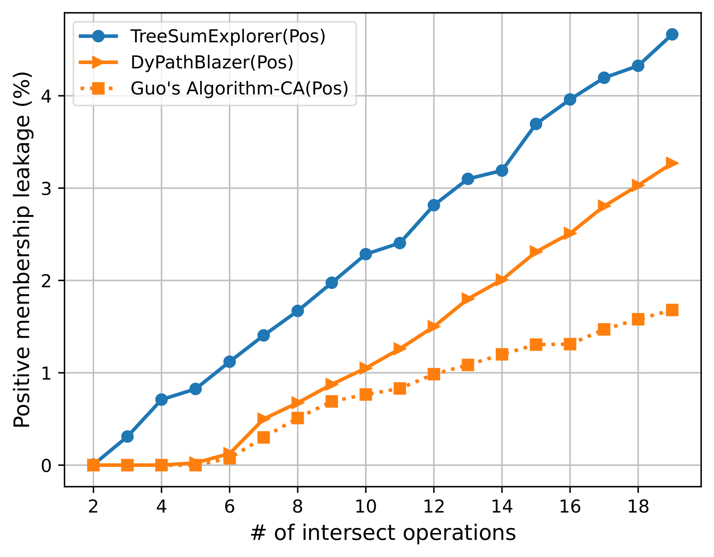
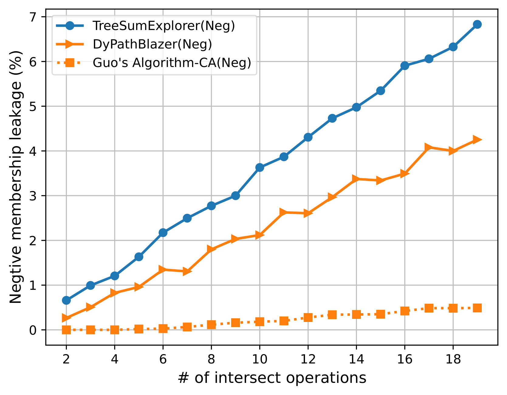
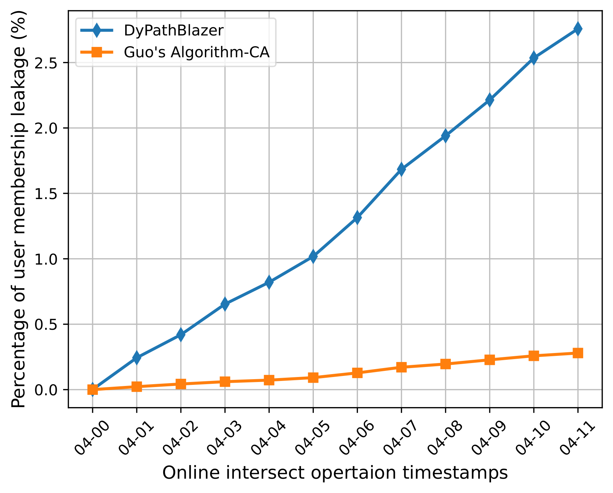
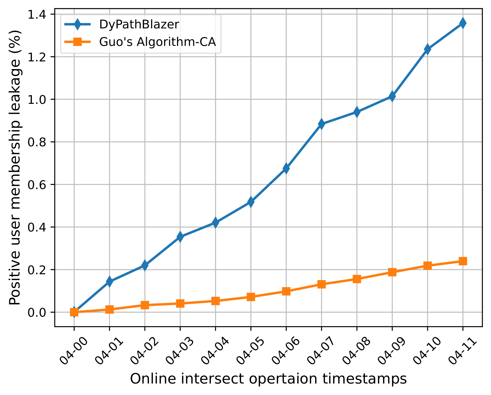

# AnonPSI: An Anonymity Assessment Framework for PSI

## Size-revealing Private Join and Compute

Private Set Intersection (PSI) is a cryptographic method that allows two parties compare encrypted versions of their sets to compute the intersection without disclosing any input information. In many applications of PSI [5,6], the objective isn't necessarily computing the intersection itself but rather functions based on the items within the intersection. Specifically, following the encrypted PSI results, downstream computation can be performed using general-purpose (MPC) protocols for statistical analysis. This process is commonly known as PSI and Compute or, alternatively, Private Join and Compute. A variety of Private Join and Compute protocols have been developed in academia and deployed in the industry. In particular, ECDH-PSI protocols are the most common in the industry due to their ease of use and capacity to handle large datasets with low communication overhead.

It is worth noting that ECDH-PSI, while keeping all data encrypted, discloses the size of the intersection set during protocol execution. We refer to such protocols as **size-revealing PSI**, which also include PSI protocols constructed through other cryptographic primitives such as homomorphic encryption and oblivious pseudorandom function. The disclosure of the intersection size can introduce vulnerabilities. It enables an adversary to infer whether a targeted individual is in the intersection or not, which is also known as the membership information. Notably, individuals who intersect with the other party's set are classified as positive members, while those outside the intersection are classified as negative members. Depending on the application context, either or both of these positive/negative memberships can be sensitive from a privacy-preserving perspective [7].

## [AnonPSI](https://arxiv.org/pdf/2311.18118.pdf): Assessing PSI Privacy through Set Membership Inference Attacks

### What is AnonPSI?

AnonPSI [1] efficiently evaluates privacy in intersection-size-revealing PSI protocols through a robust implementation of set membership inference attacks. Considering the limitation of PSI protocol runs, AnonPSI strategically selects a subset of the target dataset as PSI protocol input. It infers user membership from observed results, employing a depth-first search principle on a hierarchical structure. Each iteration's input is a subset of the previous one. AnonPSI is designed to determine the optimal input size for the current iteration, considering factors like previous input sizes, iteration outcomes, and protocol run restrictions.

#### DyPathBlazer: A bottom-up dynamic programming solution

DyPathBlazer optimizes the input size by maximizing the expected number of individuals' membership inferred within the total protocol run limitations. To achieve so, DyPathBlazer calculates an offline optimal input-size lookup table with three parameters: previous input size, previous positive membership number, and current protocol run budget. For more details about the algorithm, please refer to our research paper in [1] .


#### TreeSumExplorer: An N-SUM Guided Approach for PSI-SUM

Another algorithm included in AnonPSI, designed for evaluating PSI-SUM [5], is TreeSumExploer. Due to the specific architecture that releases the summation of intersected inputs, PSI-SUM introduces more vulnerabilities, as the adversary can combine both the summation and the intersection size for more effective attacks. TreeSumExplorer provides a feasible offline N-SUM solution that aids in better determining each individual's membership in the subset. Note that the optimal algorithm addressing the N-SUM problem incurs exponentially growing computational complexity with the size of the input. Effectively selecting the input size involves a trade-off between computation cost and the number of memberships inferred in each round. For more details about the algorithm, please refer to our research paper in [1] .

## AnonPSI's Performance

We showcase the performace of AnonPSI with two public avaiable datasets corresponding to offline setting and online setting respectively: Taobao dataset [3] and the  COVID-19 dataset [4]. We compare performance with the existing attack algorithms proposed by Guo [2]. For more details of the data sets and experiments settings,  please refer to our research paper in [1] .

The offline attack evaluations are shown in Fig. 1, where the membership leakage percentages using different attacks are compared according to different protocols' call limitations. Further, we consider two subcases when the adversary is only interested in the identity of individuals in the intersection or those who are not in the intersection, respectively.

<figure>
<div align="center">

</div>
<div align="center">

</div>
<div align = "left"> Fig. 1. Membership information leakages in PSI-SUM under different attacks.  Column 1 displays the overall membership leakage, while Column 2 represents positive membership leakage, and Column 3 represents negative membership leakage. The first row corresponds to cases where the product company targets the advertising company, and the second row corresponds to cases where the advertising company targets the product company.</div>
</figure>
<br>

For the COVID-19 dataset, it is assumed that Party A in PSI protocol is a local community that provides COVID testing services. Party B is the Lab that processes the testing results. It is assumed that Party B directly publishes testing results to each individual, so Party A is unclear which individual tests positive for COVID. On the other hand, Party A keeps monitoring the trend of total positive individuals in the community and is also interested in inferring the identity of each positive individual for targeted control. Party A calls for a PSI protocol with Party B daily. We evaluate different attacks for PSI protocol by comparing the total number of positive individuals they infer according to the testing timeline. The evaluations are shown in Fig. 2. Note that we slightly modified the DyPathBlazer to estimate and maximize only the expected number of positive members. The dataset is assumed to be updated daily but stays the same for one day. Party A's maximal protocol call limit is 10 times per day. Observe that our DyPathBlazer achieves significantly higher efficiency compared to the Guo et al.

<figure>
<div align="center">

</div>
<div align = "left"> Fig. 2. Membership information leakages in PSI under different attacks. Subcase (a) showing total membership leakage (positive member + negative member); (b) showing positive membership leakage only.</div>
</figure>

## How to Use AnonPSI

### Repository Structure

The `src` folder contains the following files:
- `utils.py`: defines basic functions used throughout the projects.
- `baseline.py`: baseline algorithm from USENIX22.
- `improved_baseline.py`: improved baseline algorithm, which leverages both positive and negative memberships.
- **`dynpathblizer.py`**: the dypathblizer algorithm based on dynamic programming.
- `dynpathblizer_params.py`: the memo generting functions in the dypathblizer algorithm.
- `actbayesian.py`: statistical attack actbayesian algorithm.
- **`treesumexpolorer.py`**: the treesumexplorer algorithm which is based on an offline N sum problem.
- `sum_only.py`: improved baseline algorithm based on sum information only.
- `test.py`: runs all algorithms in this repo and compare their performance under given parameters.

### Requirements
- Python3
- Install all dependencies via `python3 -m pip install -r requirements.txt`

### Compare among different algorithms

Here we give a simple example to compare all algorithms' performance with synthetic datasets. You can run it via `python3 test.py`.
If you want to perform attacks on a real dataset, please replace `victim_x`  and `target_y` with your real inputs.

```
    [victim_x, target_y, _] = utils.gen_dummy_set(
        victim_set_size, target_set_size, dummy_set_size, dense, interserction_cardinality)
```

## License

AnonPSI is Apache-2.0 License licensed, as found in the [LICENSE](../LICENSE) file.

## Disclaimers

This software is not an officially supported product of TikTok. It is provided as-is, without any guarantees or warranties, whether express or implied.

## Reference

[1] Jiang, Bo et al. “AnonPSI: An Anonymity Assessment Framework for PSI.” ArXiv abs/2311.18118 (2023): n. pag. url-https://arxiv.org/pdf/2311.18118.pdf

[2] Guo, Xiaojie et al. “Birds of a Feather Flock Together: How Set Bias Helps to Deanonymize You via Revealed Intersection Sizes.” USENIX Security Symposium (2022).

[3] Tianchi. Taobao display advertisement click-through rate prediction dataset, from https://tianchi.aliyun.com/dataset/datadetail?dataid=56, 2018.

[4] Machine learning-based prediction of covid-19 diagnosis based on symptoms, from https://github.com/nshomron/covidpred.

[5] Mihaela Ion, Ben Kreuter, Ahmet Erhan Nergiz, Sarvar Patel, Shobhit Saxena, Karn Seth, Mariana Raykova, David Shanahan, and Moti Yung. On deploying secure computing: Private intersection-sum-with- cardinality. In 2020 IEEE European Symposium on Security and Privacy (EuroS& P), pages 370–389, 2020.

[6] Prasad Buddhavarapu, Andrew Knox, Payman Mohassel, Shubho Sen- gupta, Erik Taubeneck, and Vlad Vlaskin. Private matching for compute. Cryptology ePrint Archive, Paper 2020/599, 2020. url- https://eprint.iacr.org/2020/599.

[7] https://github.com/tiktok-privacy-innovation/PrivacyGo/tree/main/dpca-psi
