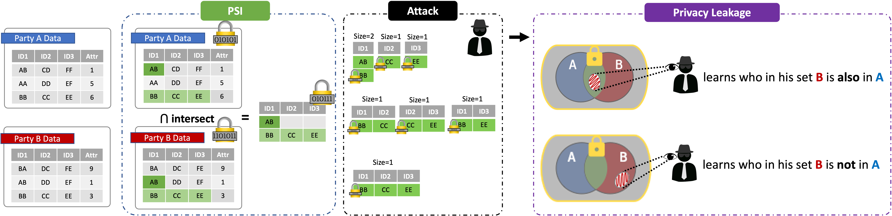
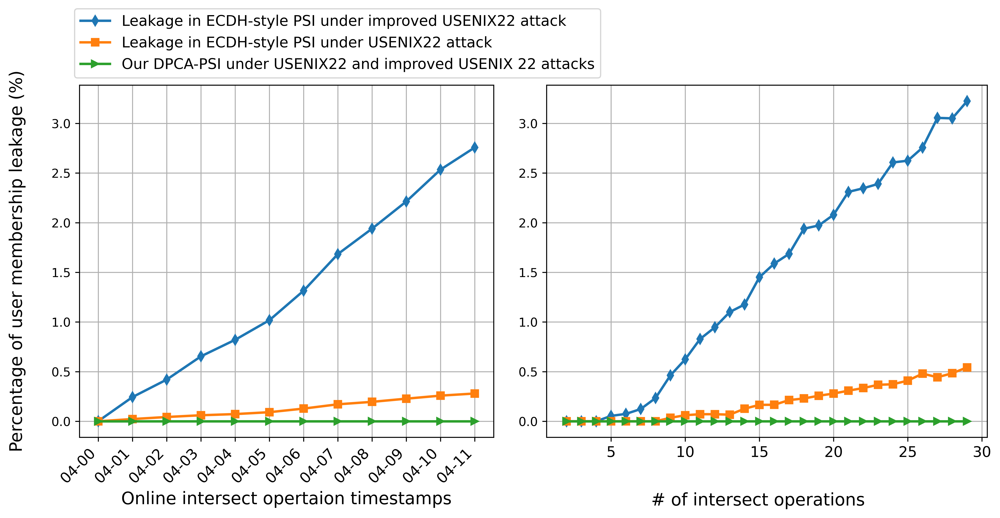

# DPCA-PSI Protocol for Privacy-Preserving Set Intersection and Compute
[](LICENSE)

## Privacy leakage in some PSI protocols

A variety of PSI protocols have been developed in academia and deployed in industry. Among them, the ECDH-style PSI protocols [1-4] have gained wider deployment than other types, owing to their low communication complexity, particularly for handling large-scale data. Additionally, it is better suited to practical requirements such as multi-ID matching. Recent studies in [USENIX22'[5]](https://www.usenix.org/system/files/sec22-guo.pdf) and [PoPETs23'[7]](https://petsymposium.org/popets/2023/popets-2023-0043.pdf) have found that ECDH-style PSI protocols that disclose the intersection size may inadvertently leak membership information about the parties' sets. Attackers can exploit this leakage to de-anonymize some data records in the party's set. Even though this does not directly violate the intended security guarantee of PSI, which is to keep each party's input set confidential, such PSI protocols can reveal additional information about whether members of one set belong to the other set or not (see Fig.1). As a result, such membership leakage could violate industry privacy requirements (Apple's App Tracking Transparency) or violate regulations such as GDPR, as one party is now able to track or link users based on the data provided by the other party.

<figure>

<div align="center">Figure 1. Illustration of privacy leakage under ECDH-style PSI.</div>
</figure>

## Multi-ID PSI is more vulnerable

When dealing with multi-ID records, ECDH-style PSIs that reveal the intersection size will leak much more information than in the single-ID record case. For example, consider a scenario where two parties each have a set of records that share three IDs to be matched, and an ECDH-style PSI protocol is performed on these two parties' records. In this case, either party involved could act as an attacker and analyze the patterns in the matched intersect sizes across all subsets of the IDs to the membership of its set members in the other party's set. If each record is represented by k IDs, and the intersection size is revealed for every subset of the k IDs with size m (where m ranges from 1 to k). Then, the number of revealed intersection sizes is approximately 2^k, which grows exponentially with k. Even if differential privacy is used to mitigate this leakage, the privacy loss from DP also accumulates exponentially as the number of IDs increases.

## What is DPCA-PSI?

In light of the de-anonymization issue of PSIs mentioned above, we have developed the DPCA-PSI protocol to reduce privacy leakage in scenarios where two parties need to compute intersection-related statistics from their private datasets.

<figure>

<div align="center">Figure 2. Illustration of our DPCA-PSI protocol.</div>
</figure>
<br>

DPCA-PSI organically integrates a PSI protocol with a two-party differentially private (DP) mechanism. We have carefully crafted DPCA-PSI to ensure secure and efficient computation of intersection-related statistics from private datasets while maintaining DP guarantees. Our DPCA-PSI offers three significant contributions to the state-of-the-art in this field:

1. **Less-revealing PSI**: In practical scenarios, each party's data records often contain multiple keys that need to be matched, leading to an exponential increase in the number of revealed intersection sizes. Our new PSI protocol reduces the number of revealed intersection sizes from exponential to linear growth, which in turn reduces the inference or linkability that can be made on the membership.

2. **IntersectMask DP**: We complemented our less-revealing PSI with a novel distributed DP mechanism where two parties perform an analysis of their intersection size while preserving privacy for both datasets. We name this two-party DP mechanism as IntersectMask Mechanism, which requires adding carefully crafted dummy variables to each party's data records, further protecting the linear number of revealed sizes in our less-revealing PSI.

3. **Efficient DP**: Our DP only induces small communication and computational overhead to ensure that subsequent intersection-related computations are less noisy. Our tight DP composition maximizes the number of intersect operations within a given DP privacy budget. The ratio between the data size after our protocol and that of the original data is 1.007:1, allowing for more accurate downstream computation on the intersection results.

## How does DPCA-PSI hold against the previous attack?

<figure>
<div align="center">

</div>
<div align="center">Figure 3. Percentage of user membership leakage of ECDH-style PSI and our DPCA-PSI in both online and offline attack scenarios </div>
</figure>
<br>

We replicated the membership inference attack described in the study [5] and further optimized it. Our attack experiments were conducted using the open-source PSI protocols widely used in the industry [2-4], on a COVID data set [6], as shown in Fig. 2. The left graph represents an online attack scenario where data arrives in streams, resembling real-world settings. The right graph represents an offline attack scenario. It is observed that our DPCA-PSI protocol does not reveal any membership information under the (optimized) USENIX'22 inference attack [5], even when conducting up to 30 intersect operations.

In addition, DPCA-PSI demonstrates high efficiency in practice, as evidenced in Table 1, which shows the computation and time costs of using DPCA-PSI with both a single ID (table on the left) and multiple IDs (table on the right). When compared to PS3I,  which is an open-source ECDH-based set intersection protocol, DPCA-PSI outperforms in terms of privacy protection and efficiency. Table 2 shows the impact of DPCA-PSI on the input data size. Our protocol introduced only 0.01% "noisy data" for DP in relation to the original data, resulting in significantly improved accuracy for subsequent computation tasks.

<figure>
<div align="center">

</div>
<br>
<div align = "left">Table 1. Results of time and communication costs of running the DPCA-PSI, Private-ID, and PS3I (an ECDH-based protocol) for various numbers of users. We benchmarked all protocols in a LAN network setting (10Gbit/s network with a latency of 0.2 ms). </div>
</figure>
<br>

<figure>
<div align="center">

</div>
<div align = "center">Table 2. The percentages of the size of the dummy data in relation to the input data for DPCA-PSI, based on various numbers of users.</div>
</figure>

## How to use DPCA-PSI

### Requirements

- Linux
- CMake (>=3.15)
- GNU G++ (>=5.5) or Clang++ (>= 5.0)
- Python 3

### Building DPCA-PSI

DPCA-PSI depends on [Intel Paillier Cryptosystem Library (IPCL)](https://github.com/intel/pailliercryptolib).
We choose IPCL because it is certified for ISO compliance.
Unfortunately, IPCL introduces a number of [issues](#issues-with-intel-pailllier-cryptosystem-library).
Here we provide the following scripts to help users install IPCL (without `sudo`).

First, install NASM with `apt install nasm`, or build and install NASM from source code downloaded from [NASM's official page](https://www.nasm.us/). Assume that you are working in the root directory of NASM source code.
```shell
./configure
make -j
make install
```

Second, build and install IPCL using the following scripts.
Assume that IPCL is cloned into the directory `${IPCL}` and will be installed to the directory `${IPCL_INSTALL_DIR}`.
```shell
cmake -B ${IPCL}/build -S ${IPCL} -DCMAKE_INSTALL_PREFIX=${IPCL_INSTALL_DIR} -DCMAKE_BUILD_TYPE=Release -DIPCL_TEST=OFF -DIPCL_BENCHMARK=OFF
cmake --build ${IPCL}/build -j
cmake --build ${IPCL}/build --target install
```

Third, build [JSON for Modern C++ (JSON)](https://github.com/nlohmann/json) using the following scripts.
Assume that JSON is cloned into the directory `${JSON}`.
```shell
cmake -B ${JSON}/build -S ${JSON}
cmake --build ${JSON}/build -j
```

At last, build DPCA-PSI using the following scripts.
Assume that DPCA-PSI is cloned into the directory `${DPCA-PSI}`.
```shell
cmake -B ${DPCA-PSI}/build -S ${DPCA-PSI} -DCMAKE_BUILD_TYPE=Release -DIPCL_DIR=${IPCL_INSTALL_DIR}/lib/cmake/ipcl-2.0.0  -Dnlohmann_json_DIR=${JSON}/build
cmake --build ${DPCA-PSI}/build -j
```

Output binaries can be found in `${DPCA-PSI}/build/lib/` and `${DPCA-PSI}/build/bin/` directories.

| Compile Options          | Values       | Default | Description                         |
|--------------------------|--------------|---------|-------------------------------------|
|`CMAKE_BUILD_TYPE`        | Release/Debug| Release | The build type.                     |
| `DPCA_PSI_BUILD_SHARED_LIBS` | ON/OFF        | OFF     | Build a shared library if set to ON.          |
| `DPCA_PSI_BUILD_EXAMPLE`        | ON/OFF        | ON      | Build C++ example if set to ON.                 |
| `DPCA_PSI_BUILD_TEST`                | ON/OFF        | ON      | Build C++ test if set to ON.                        |
| `DPCA_PSI_BUILD_DEPS`               | ON/OFF        | ON      | Download and build unmet dependencies if set to ON. |

DPCA-PSI further depends on [OpenSSL](https://github.com/openssl/openssl), [gflags](https://github.com/gflags/gflags), [Google Logging](https://github.com/google/glog), and [Google Test](https://github.com/google/googletest).
The build system will try to find these dependencies if they exist or will otherwise automatically download and build them.

### Running the DPCA-PSI protocol

Here we give a simple example to run our protocol. Please refer to [Example running DPCA-PSI](example/README.md) for more details.

To run Party A
```shell
cd ${DPCA-PSI}/build/example/scripts
bash sender_test.sh
```

To run Party B
```shell
cd ${DPCA-PSI}/build/example/scripts
bash receiver_test.sh
```

### Issues with Intel Pailllier Cryptosystem Library

- A user has to install [Netwide Assembler (NASM)](https://www.nasm.us/) and export the environment variable `nasm`. [(issue #70)](https://github.com/intel/pailliercryptolib/issues/70).
- IPCL does not support GNU G++ 11.0 and above. [(issue #27)](https://github.com/intel/pailliercryptolib/issues/27#issuecomment-1320753239).
- `IPCLConfig.cmake` resides in a wrong directory without installing IPCL. [(issue #69)](https://github.com/intel/pailliercryptolib/issues/69).

## License

DPCA-PSI is Apache-2.0 License licensed, as found in the [LICENSE](../LICENSE) file.

## Disclaimers

This software is not an officially supported product of TikTok. It is provided as-is, without any guarantees or warranties, whether express or implied.

## Reference
[1] Meadows, Catherine. "A more efficient cryptographic matchmaking protocol for use in the absence of a continuously available third party." 1986 IEEE Symposium on Security and Privacy. IEEE, 1986.

[2] Ion, Mihaela, et al. "On deploying secure computing: Private intersection-sum-with-cardinality." 2020 IEEE European Symposium on Security and Privacy (EuroS&P). IEEE, 2020.

[3] Buddhavarapu, Prasad, et al. "Private matching for compute." Cryptology ePrint Archive (2020)

[4] Buddhavarapu, Prasad, et al. "Multi-key private matching for compute." Cryptology ePrint Archive (2021).

[5] Guo, Xiaojie, et al. "Birds of a Feather Flock Together: How Set Bias Helps to Deanonymize You via Revealed Intersection Sizes." 31st USENIX Security Symposium (USENIX Security 22). 2022.

[6] https://github.com/nshomron/covidpred

[7] Powar, Jovan, and Alastair R. Beresford. "SoK: Managing risks of linkage attacks on data privacy." Proceedings on Privacy Enhancing Technologies 2 (2023): 97-116.
