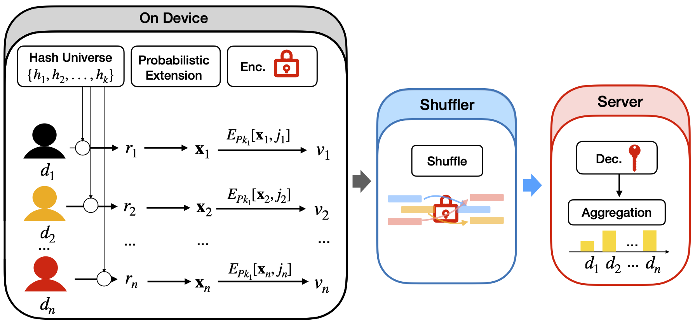
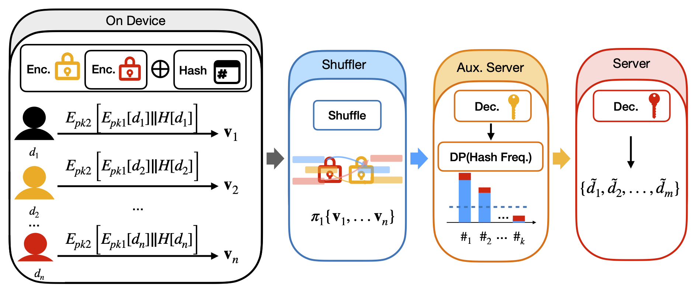

# Privacy-Preserving Data Collection with Local Differential Privacy

Local Differential Privacy (LDP) is a privacy-preserving technique in which data is randomized before being shared, ensuring that each individual’s information remains hidden even from data collectors. By adding controlled noise or transformations on the client side, LDP enables useful aggregate analysis without compromising user privacy.

## General Count Mean Sketch Protocol for Local Differential Privacy

We propose the Generalized Count-Mean-Sketch (GCMS) protocol, which builds on Apple's CMS by accounting for randomness in responses and hash collisions, improving accuracy under the LDP model. GCMS reduces communication costs while maintaining privacy and provides a utility guarantee for optimal parameter design.

To further enhance privacy, we use the Encryption-Shuffling-Analysis (ESA) framework. Clients' encoded outputs are encrypted and shuffled by a trusted shuffler, breaking the link between clients and responses and amplifying privacy. The server then aggregates and analyzes the shuffled data.

The overview of the protocol is as follows:

Preparation:
  Before data collection, the server generates $k$ independent hash functions $\mathcal{H} \overset{\Delta}{=} \{h_1,h_2,...,h_k\}$, where each hash function deterministically maps any input to a discrete number in $[\mathbf{m}]=[1,...,m]$, with $m$ being the hashing range, $\mathcal{H}$ being the universe of hash functions. The server then sends $\mathcal{H}$ and its public key $pk$ to each client.

The entire data collection pipeline is illustrated in Figure above. It consists of three distinct phases, each operating on different platforms:
1. The initial phase involves all on-device algorithms, including hash encoding and privatization, and encryption with the server's public key $pk$.
2. The encrypted privatized data is then transmitted through an end-to-end encrypted channel and received by the shuffler. The shuffler then forwards the data to the server after a random shuffling operation.
3. Finally, the server decrypts the input data, performs data aggregation, and obtains the Frequency Lookup Table - a sketch matrix $\mathcal{M}$.

Phase 1: On-device operations.

We present the process for a single data privatization and encryption, which consists of the following steps.
1. Hash Encoding: Each client first uniformly selects a hash function from $\{h_1, h_2, \ldots, h_k\}$;and calculates a hashed value $r=h_j(d)$ of their raw data $d$.
2. Probabilistic Inclusion: Each client initializes their privatized vector $\textbf{x}$ as an empty set, then adds $r$ to $\textbf{x}$ with probability $p \in [0.5,1]$.
3. Probabilistic Extension: Set the extension domain for each client as $[\mathbf{m}]/r = \{1, 2, \ldots, r-1, r+1, \ldots, m\}$. If $r$ is added to $\textbf{x}$, then uniformly select $s-1$ elements from $[\mathbf{m}]/r$ and append them to $\textbf{x}$. If $r$ is not added to $\textbf{x}$, then uniformly select $s$ elements from $[\mathbf{m}]/r$ and append them to $\textbf{x}$. Return the privatized vector along with the selected hash index $\langle \textbf{x}, j \rangle$.
4. Encryption and Release: Each client encrypts $\langle \textbf{x}, j \rangle$ with the server's public key $pk$ to obtain $v = E_{pk}[\textbf{x}, j]$, then releases $v$ to the shuffler.

Phase 2: Shuffler's anonymization and shuffling.

 This phase, which is standard, involves Anonymization and Shuffling.

Phase 3: Server's aggregation and frequency estimation.

The server first decrypts messages with the secret key and obtains: π(⟨x₁, j₁⟩, ⟨x₂, j₂⟩, …, ⟨xₙ, jₙ⟩).
Then, the server-side algorithm constructs a sketch matrix, in which the rows are indexed by hash functions, and each row $j$ is the sum of the privatized vector of clients who selected the hash function $h_j$. To estimate the frequency of a message $d$, the server calculates all the hashed values of $d$: $h_j[d]^k_{j=1}$, and then aggregates the total count from the sketch matrix $\mathcal{M}$:
 $C(d) = \sum_{j=1}^k \mathcal{M}_j[h_j[d]].$
An unbiased estimator for estimating the numbers of $d$ occurring is
$\hat{f}(d) = \frac{C(d) - \frac{p n}{m} - q n\left(1 - \frac{1}{m}\right)}{(p - q)\left(1 - \frac{1}{m}\right)}$

where $q= \frac{s-p}{m - 1}$.

For more details, please refer to our [latest paper](https://arxiv.org/pdf/2412.17303).

## Privacy-Preserving Data Collection from Unknown Domains

Collecting data from unknown domains is a common challenge in real-world applications, such as identifying new words in text inputs, or tracking emerging URLs. Current solutions often suffer from high computational and communication costs. To address this, we propose a Quasi-Local Privacy Protocol for collecting items from unknown domains. Our protocol combines central Differential Privacy (DP) techniques with cryptographic tools within the Encryption-Shuffling-Analysis (ESA) framework. This approach provides privacy guarantees similar to Local Differential Privacy (LDP) while significantly reducing computational overhead.

Our protocol uses an auxiliary server to construct histograms without accessing the original data. This allows the protocol to achieve accuracy similar to the central DP model, while still providing privacy protections akin to Local Differential Privacy (LDP). The technique leverages a stability-based histogram method integrated into the ESA framework, where the auxiliary server builds histograms from encrypted messages, ensuring privacy without tracing the original data. By eliminating the need for message segmentation and reconstruction, our protocol delivers central DP-level accuracy while maintaining LDP-like privacy guarantees.

### Protocol Overview

Our protocol uses the stability-based histogram technique [1] for collecting new data. To prevent direct data collection and tracing by the server, we integrate the ESA framework. Additionally, we introduce an auxiliary server to construct the histogram, similar to a central curator in the central DP model, but with a crucial distinction: the auxilary server does not access the original data messages. Instead, it only receives an encrypted version of the data $d$ encrypted with the server's public key $E_{pk1}[d]$, along with its hashed value $H[d]$. This ensures the auxiliary server gains no knowledge of the original message, except for the irreversible hash.
To construct the histogram, the auxiliary server counts the number of message $d$ by counting the corresponding hashed value $H[d]$. Each historgram bin is represented by a sampled $E_{pk1}[d]$, which can only be decrypted by the server. To enhance security, the messages passing through the shuffler between the auxiliary server and clients are further encrypted using the auxiliary server's public key: $E_{pk2} [E_{pk1}[d] || H[d]]$.

The overall framework contains four phases and is shown in Figure 2. We now describe each step in detail.

Before data collection begins, the server and the auxiliary server send their public keys, $pk1$ and $pk2$, to each client. They also agree on a set of privacy parameters $(\epsilon,\delta)$ for the DP guarantees for the release.

Phase 1: On-Device Processing

1. Data Encryption with Server's Public Key: The client encrypts the data with the server's public key, and the cyphertext is denoted as $E_{pk1}[d]$.
2. Data Hashing: The private data is then hashed by a hash function, denoted as $H$ (which is unique for each client but identical across all clients). The hashed result is denoted as $H[d]$.
3. Encryption with the Auxiliary Server's Public Key: Finally, the encrypted data and its hashed value are encrypted with the auxiliary server's public key. The encrypted message is denoted as $v = E_{pk2} [E_{pk1}[d] || H[d]]$

Phase 2: Shuffler's Anonymization and Shuffling

1. The encrypted message is passed on to the shuffler through an end-to-end encrypted channel. The shuffler then performs anonymization and shuffling after receiving each client's input, which is standard.

Phase 3: The auxiliary server applies Differential Privacy (DP) protection when releasing the item names.
1. Decrypt Messages: The first step is to decrypt the messages received from the shuffler using the secret key. The server then observes the following encrypted data: $\{E_{pk1}[d_1] || H[d_1],...,E_{pk1}[d_n] || H[d_n]\}$
2. Hash Frequency Calculation: Since each client uses the same hash function, the hashed results for different clients with identical items must be identical. The auxiliary server calculates the frequency of each hashed result and attaches the corresponding encrypted data to it.
3. Add DP Noise: The auxiliary server then adds Laplacian noise with scale $b$ to the frequency of each hashed result. For those hashed results with noisy frequencies above a threshold $T$, the auxiliary server randomly samples from the corresponding encrypted data and releases it to the server.

Phase 4: Server Decrypts Messages

1. In the final phase, the server decrypts the messages received from the auxiliary server to obtain the plaintext, which contains the item names.
Privacy and Utility Analysis
Privacy Analysis: The proposed protocol ensures differential privacy. Specifically, the released encrypted item set $S$ is $(\epsilon,\delta)$-differentially private with
$\epsilon = \max\left(\frac{1}{b}, \log\left(1 + \frac{1}{2 e^{(T-1)/b} - 1}\right)\right)$

and $\delta=\frac{1}{2}\exp(\epsilon(1-T)).$

For a detailed analysis, please refer to our [latest paper](https://arxiv.org/pdf/2412.17303).

## How to Use

### Repository Structure

The `src` folder contains the following files:
- `gcms.py`: A demo illustration of General Count Mean Sketch (GCMS) Framework.
- `gcms_client.py`: On-device LDP Algorithm in General Count Mean Sketch (GCMS) Framework.
- `gcms_server.py`: Server in General Count Mean Sketch (GCMS) Framework.
- `gcms_shuffler.py`: Shuffler in General Count Mean Sketch (GCMS) Framework.
- `unknown_domain.py`: A demo illustration of Privacy-Preserving Data Collection with Unknown Domain.
- `unknown_domain_client.py`: On-device algorithm in Privacy-Preserving Data Collection with Unknown Domain.
- `unknown_domain_aux_server.py`: Auxiliary Server in Privacy-Preserving Data Collection with Unknown Domain.
- `unknown_domain_server.py`: Server in Privacy-Preserving Data Collection with Unknown Domain.

### Requirements
- Python3
- Install all dependencies via `python3 -m pip install -r requirements.txt`

### How to simulate two protocols
Here we give two examples to simulate the protocol of GCMS and Privacy-Preserving Data Collection with Unknown Domain respectively. You can run it via `python3 gcms.py` and `python3 unknown_domain.py`.

## License

PrivacyGo is Apache-2.0 License licensed, as found in the [LICENSE](LICENSE) file.

## Disclaimers

This software is not an officially supported product of TikTok. It is provided as-is, without any guarantees or warranties, whether express or implied.

## Reference
[1] A. Korolova, K. Kenthapadi, N. Mishra, and A. Ntoulas, “Releasing search queries and clicks privately,” in Proceedings of the 18th international conference on World wide web, 2009, pp. 171–180.
